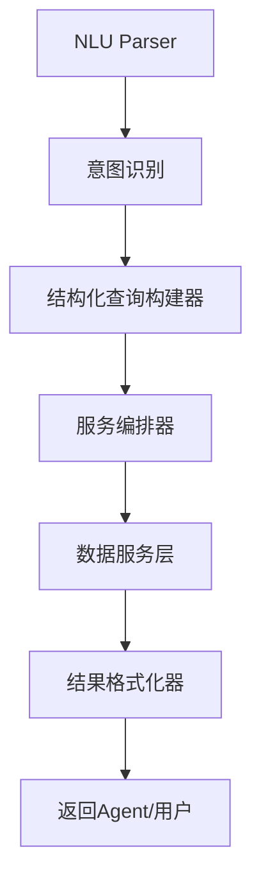
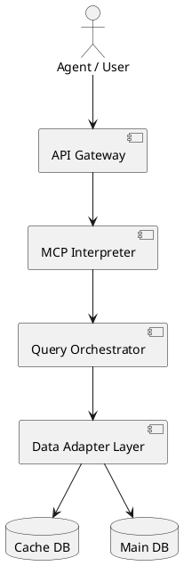
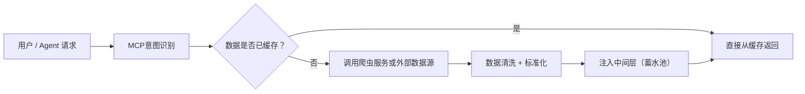

# QuantDB 愿景与路线图（面向Agent时代）

> **版本**：vVISION-2.0
> **最后更新**：2025-05-13
> **负责人**：Ye Sun

---

## 目录

1. [愿景声明](#1-愿景声明)
2. [核心目标](#2-核心目标)

   * [2.1 开放式数据服务层](#21-开放式数据服务层)
   * [2.2 MCP协议与Agent互操作](#22-mcp协议与agent互操作)
3. [关键里程碑](#3-关键里程碑)
4. [架构演进](#4-架构演进)
5. [未来路线与开源战略](#5-未来路线与开源战略)
6. [附录与资源](#6-附录与资源)
7. [行业挑战与中间层设计思考](#7-行业挑战与中间层设计思考)
8. [AI原生能力的未来角色探讨](#8-ai原生能力的未来角色探讨)

---

## 1. 愿景声明

**QuantDB** 旨在构建面向 Agent 时代的**下一代开源金融智能中间件平台**，通过 **MCP（Model Context Protocol）协议**标准化自然语言与金融数据之间的接口，支持 AI 原生、上下文感知、结构化响应的金融服务。

我们追求的核心转变：

* 从 **查询型API** → **交互式智能Agent接口**
* 从 **静态数据管道** → **动态上下文增强数据服务**
* 从 **服务消费者** → **Agent工具链提供者**

---

## 2. 核心目标

### 2.1 开放式数据服务层

| 功能组件      | 技术要求                | 说明                            |
| --------- | ------------------- | ----------------------------- |
| 智能缓存引擎    | 50ms 响应时间 (≥95%命中率) | 支持高频行情/指标缓存                   |
| 数据源整合网关   | ≥5个主流金融开源/商用数据源     | 支持 AKShare, Tushare, JQData 等 |
| 数据清洗与统一模型 | schema 统一、增量合并      | 统一字段与质量校验，具备追溯能力              |
| 弹性更新机制    | 延迟 < 10 分钟，具备追踪标记   | 增量更新、错误识别、补齐机制                |

### 2.2 MCP协议与Agent互操作

MCP（Model Context Protocol）是 QuantDB 的核心语义桥梁，将自然语言请求转化为结构化、可执行、上下文感知的任务协议。

**示例结构：**

```json
{
  "query": "展示上证指数近三个月的走势",
  "intent": "price_trend",
  "context": {
    "visualization": "candlestick",
    "timezone": "Asia/Shanghai"
  },
  "session_id": "xyz123",
  "response_type": "structured"
}
```

**MCP核心模块：**



---

## 3. 关键里程碑

### 2024 Q2-Q3：数据层 + MCP框架初步完成

```gantt
dateFormat  YYYY-MM-DD
section 核心服务构建
缓存系统重构        :done,    cache, 2024-04-01, 30d
数据源网关集成      :active,  source, 2024-04-20, 45d
MCP协议V1发布       :         mcp, 2024-06-01, 30d

section API服务层
标准化接口体系      :         api, 2024-06-15, 30d
上下文服务框架      :         context, 2024-07-01, 30d
```

### 2024 Q4：智能服务能力落地

* 多轮NL交互支持
* Agent专用QueryKit插件发布
* Trend / Backtest / Compare 等扩展能力

---

## 4. 架构演进

### 当前系统组件图



### 协议演进计划

| 协议版本     | 关键特性             | 状态  |
| -------- | ---------------- | --- |
| MCP v0.1 | 基础结构化查询支持        | 已完成 |
| MCP v0.5 | 意图识别 + 会话上下文     | 开发中 |
| MCP v1.0 | 插件注册机制 + 多模态语义映射 | 规划中 |

---

## 5. 未来路线与开源战略

### 开源战略关键词

* **透明协议栈**：MCP协议将以 Apache/MIT 协议开放
* **可自部署框架**：支持本地化部署与云原生集成
* **插件化生态**：第三方可接入意图识别器、数据源插件、Agent工具适配器

### Agent生态对接路线

| Agent平台       | 对接形式               | 目标时间    |
| ------------- | ------------------ | ------- |
| LangChain     | Tool + Function    | 2024 Q4 |
| OpenAI Plugin | OpenAPI + Prompt接口 | 2025 Q1 |
| AutoGPT       | ToolAgent模块        | 2025 Q1 |

---

## 6. 附录与资源

* [API设计规范文档](docs/api_design_spec.md) - API接口设计规范和最佳实践
* [系统架构图](docs/03_system_architecture.md) - 详细的系统架构设计文档
* [MCP协议定义文档](docs/mcp_protocol_spec.md) - MCP协议的详细规范和示例
* [NLU与语义图谱模型说明](docs/nlu_semantic_model.md) - 自然语言理解和语义图谱模型的技术说明
* [开发路线图](docs/04_roadmap.md) - 详细的开发计划和里程碑
* [业务规则参考](docs/01_business_rules.md) - 系统业务规则和逻辑说明
* [业务对象设计](docs/02_business_objects_design.md) - 核心业务对象的设计说明

---

## 7. 行业挑战与中间层设计思考（与AKShare的差异化定位）

### 背景现状

以 AKShare 为代表的工具虽然广泛使用，但其**面向页面爬虫架构的被动式数据获取模型**已难以支撑 Agent 时代的智能化、实时化需求，存在如下核心问题：

| 问题类型   | 描述                                  |
| ------ | ----------------------------------- |
| 高频不可用  | 页面结构变化、反爬机制触发导致请求失败，尤其在批量/并发场景下尤为明显 |
| 缺乏缓存机制 | 相同数据反复请求均需重新爬取，缺少命中优化与访问成本控制机制      |
| 无共享状态  | 多Agent之间无法共享数据上下文或数据结果，资源浪费严重       |
| 非结构化注入 | 数据注入时缺乏统一格式、溯源与版本控制，不利于标准化管理与自动服务编排 |

### QuantDB 的中间层策略

我们提出构建**智能数据中间层（Smart Buffer Layer）**，作为“数据蓄水池”模型：



### 模块设计亮点

| 模块       | 作用                                     |
| -------- | -------------------------------------- |
| 数据注入策略器  | 控制哪些数据应进入中间层，基于意图频次、策略、时间窗自动调控         |
| 数据复用索引器  | 多Agent或用户的相同数据请求可直接命中历史记录，避免重复抓取       |
| 增量感知更新引擎 | 中间层数据具备“新鲜度标签”，可自动触发更新与补齐              |
| 高并发访问调度器 | 保障Agent批量请求下的异步调度与限流机制，实现弹性服务交付        |
| 降级缓存回退机制 | 数据源失效时可回退至本地缓存并返回提示，维持服务稳定性与Agent处理链闭环 |

### 面向Agent的战略价值

| 需求场景     | 中间层响应机制                          |
| -------- | -------------------------------- |
| 高频低延迟任务  | 热点数据缓存复用，支持日内分析、行情推送等实时任务        |
| 多Agent协同 | 同一数据上下文跨Agent共享，构建一致的数据层语义       |
| 自动数据演化   | 基于行为触发的数据注入与淘汰，构建Agent-驱动的数据进化模式 |

---

## 8. AI原生能力的未来角色探讨

> 注：原“2.3 AI原生能力”章节已移除，此部分作为后续演进方向保留。

当前我们认为，AI原生能力（如Prompt编排、RAG集成、意图层智能）更适合在LLM层或Agent插件层进行实现，MCP服务本身专注于语义结构协议、上下文调度与数据接口编排。未来我们将继续探索AI能力与中间层/协议层之间的边界定位，并视行业发展节奏持续调整QuantDB在该方向的设计。
