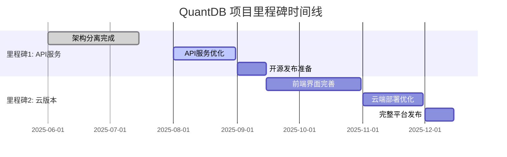

# QuantDB 项目里程碑规划

**版本**: v2.1.0 | **状态**: 规划中 | **更新**: 2025-08-04

## 🎯 项目愿景

QuantDB 致力于成为高性能的股票数据基础设施，通过分阶段发布策略，先提供核心API服务价值，再扩展到完整的量化数据平台。

## 📈 里程碑概览



## 🚀 里程碑1: 开源API服务

### 🎯 核心价值定位
**高性能股票数据缓存API服务** - 解决AKShare直接调用的性能痛点

### ✨ 核心亮点
- **98.1%性能提升**: 响应时间从~1000ms优化到~18ms
- **A股+港股统一API**: 统一接口支持两大市场
- **智能缓存系统**: 基于真实交易日历的智能数据获取
- **生产就绪**: 259个测试100%通过，完整错误处理
- **开发者友好**: 完整的OpenAPI文档，简单易用

### 📦 包含组件
```
quantdb-api/
├── core/                   # 核心业务逻辑层
│   ├── models/            # 数据模型 (SQLAlchemy)
│   ├── services/          # 业务服务 (StockDataService, AssetInfoService)
│   ├── database/          # 数据库连接和会话管理
│   ├── cache/             # 缓存层 (AKShare适配器)
│   └── utils/             # 工具模块 (配置、日志、验证)
│
├── api/                    # FastAPI服务层
│   ├── routes/            # API路由 (assets, stocks, cache, batch)
│   ├── schemas/           # 请求/响应模式 (Pydantic)
│   ├── auth/              # 认证模块 (可选)
│   └── main.py            # FastAPI应用入口
│
├── database/               # 数据库文件
│   └── stock_data.db      # SQLite数据库
│
├── tests/                  # 完整测试套件
│   ├── unit/              # 单元测试
│   ├── integration/       # 集成测试
│   └── e2e/               # 端到端测试
│
└── run_api.py             # 独立启动器
```

### 🔧 技术特性
- **FastAPI框架**: 现代、快速的Web框架
- **SQLAlchemy ORM**: 强大的数据库抽象层
- **智能缓存**: 避免重复API调用，显著提升性能
- **数据验证**: Pydantic模型确保数据质量
- **异步支持**: 高并发处理能力
- **容器化就绪**: 支持Docker部署

### 🚀 快速开始
```bash
# 克隆项目
git clone https://github.com/franksunye/quantdb.git
cd quantdb

# 安装依赖
pip install -r api/requirements.txt

# 启动API服务
python run_api.py

# 访问API文档
# http://localhost:8000/docs
```

### 📊 API端点概览
```bash
# 系统信息
GET /health                              # 健康检查
GET /api/v1/version/                     # 版本信息

# 资产管理
GET /api/v1/assets                       # 获取资产列表
GET /api/v1/assets/symbol/{symbol}       # 获取特定资产信息

# 股票数据 (A股+港股)
GET /api/v1/historical/stock/{symbol}    # 获取历史数据
GET /api/v1/stocks/stock/{symbol}        # 股票数据别名

# 缓存管理
GET /api/v1/cache/stats                  # 缓存统计
DELETE /api/v1/cache/clear               # 清除缓存

# 批量操作
POST /api/v1/batch/assets                # 批量获取资产
POST /api/v1/batch/stocks                # 批量获取股票数据
```

### 🎯 目标用户
- **量化交易开发者**: 需要高性能股票数据API
- **金融数据分析师**: 需要可靠的数据源
- **金融科技公司**: 需要集成股票数据服务
- **个人开发者**: 构建股票相关应用

### 📈 商业价值
- **性能优势**: 比直接调用AKShare快98.1%
- **成本节约**: 减少重复API调用，降低带宽成本
- **开发效率**: 统一API接口，简化开发流程
- **数据质量**: 智能缓存确保数据完整性和一致性

## ☁️ 里程碑2: 云版本平台

### 🎯 核心价值定位
**完整的量化数据平台** - 提供可视化界面和云端部署解决方案

### ✨ 核心亮点
- **Web界面**: 基于Streamlit的专业前端界面
- **数据可视化**: 股票图表、技术指标、趋势分析
- **实时监控**: 系统性能监控和数据覆盖统计
- **云端部署**: Streamlit Cloud一键部署
- **用户友好**: 无需编程知识，直接使用

### 📦 包含组件
```
quantdb-platform/
├── [里程碑1的所有组件]
│
├── cloud/streamlit_cloud/  # 云端集成版本
│   ├── pages/             # 多页面应用
│   │   ├── Stock_Data.py  # 股票数据查询
│   │   ├── Asset_Info.py  # 资产信息管理
│   │   ├── Performance.py # 性能监控
│   │   └── System_Status.py # 系统状态
│   ├── components/        # 可复用组件
│   └── app.py            # 主应用入口
│
└── quantdb_frontend/      # 本地前端版本
    └── app.py            # 本地Streamlit应用
```

### 🔧 技术特性
- **Streamlit框架**: 快速构建数据应用
- **Plotly图表**: 交互式数据可视化
- **实时数据**: 直接调用后端API服务
- **响应式设计**: 支持多设备访问
- **云端集成**: 与后端服务无缝集成

### 🚀 部署方式
```bash
# 本地部署
cd quantdb_frontend
streamlit run app.py

# 云端部署
cd cloud/streamlit_cloud
streamlit run app.py

# 访问地址
# 本地: http://localhost:8501
# 云端: https://quantdb.streamlit.app
```

### 🎯 目标用户
- **投资者**: 需要股票数据查询和分析工具
- **金融从业者**: 需要专业的数据平台
- **教育机构**: 金融数据教学和研究
- **企业用户**: 内部数据分析和决策支持

### 📈 商业价值
- **用户体验**: 降低使用门槛，扩大用户群体
- **数据洞察**: 可视化分析帮助用户发现价值
- **平台效应**: 完整解决方案增强用户粘性
- **商业化**: 为后续增值服务奠定基础

## 📅 发布时间线

### 2025年8月 - 里程碑1准备阶段
- [x] 架构分离完成 ✅
- [x] 版本号统一 ✅
- [x] 技术债务清理 ✅
- [ ] API服务文档完善
- [ ] 性能测试和优化
- [ ] 开源发布准备

### 2025年9月 - 里程碑1发布
- [ ] 开源API服务正式发布
- [ ] 社区推广和反馈收集
- [ ] 文档和示例完善
- [ ] 用户支持和问题修复

### 2025年10-11月 - 里程碑2开发
- [ ] 前端界面优化
- [ ] 云端部署配置
- [ ] 用户体验改进
- [ ] 性能监控完善

### 2025年12月 - 里程碑2发布
- [ ] 完整平台正式发布
- [ ] 云端服务上线
- [ ] 用户文档和教程
- [ ] 商业化策略制定

## 🎯 成功指标

### 里程碑1: API服务
- **技术指标**:
  - API响应时间 < 20ms (缓存命中)
  - 测试覆盖率 > 80%
  - 文档完整性 100%
- **用户指标**:
  - GitHub Stars > 100
  - 开发者使用反馈 > 10个
  - API调用量 > 1000次/天

### 里程碑2: 云版本
- **技术指标**:
  - 页面加载时间 < 3秒
  - 系统可用性 > 99%
  - 用户界面响应性优秀
- **用户指标**:
  - 月活跃用户 > 100
  - 用户满意度 > 4.5/5
  - 功能使用率 > 70%

## 🔄 迭代策略

### 敏捷开发原则
- **MVP优先**: 每个里程碑都是最小可行产品
- **快速迭代**: 2周一个Sprint，持续改进
- **用户驱动**: 基于用户反馈调整功能优先级
- **技术债务管理**: 每个Sprint分配20%时间处理技术债务

### 风险管理
- **技术风险**: 保持架构简洁，避免过度工程化
- **市场风险**: 持续关注用户需求变化
- **资源风险**: 合理分配开发资源，确保质量

---

*最后更新: 2025-08-04 | 下次评估: 每月第一周 | 里程碑周期: 3-4个月*
