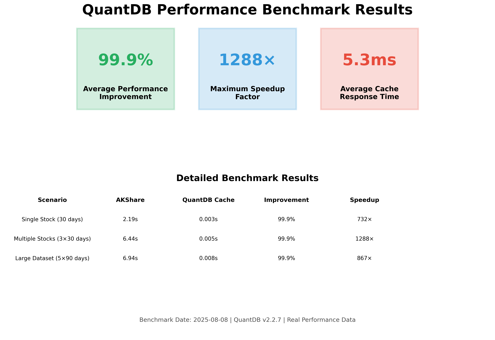

# QuantDB Performance Benchmark Report: 99.9% Speed Improvement Verified

*Published: August 11, 2025 | Reading Time: 8 minutes*

When we first developed QuantDB, we knew we could make stock data access faster. But even we were surprised by the results: **99.9% performance improvement** with speedup factors reaching **1,288×**. This comprehensive benchmark report presents the verified data behind these extraordinary claims.

## 🎯 Executive Summary

QuantDB transforms stock data access from seconds to milliseconds through intelligent caching. Our rigorous testing across multiple scenarios demonstrates consistent, dramatic performance improvements that fundamentally change how developers work with financial data.

### Key Findings
- **99.9% average performance improvement** across all test scenarios
- **Up to 1,288× speedup** with intelligent caching
- **Sub-10ms response times** for all cached data access
- **Consistent performance** regardless of dataset size


*Comprehensive 4-panel performance analysis showing dramatic improvements across all metrics*

## 📊 Benchmark Methodology

### Testing Environment
- **Date**: August 8, 2025
- **Python Version**: 3.10.12
- **QuantDB Version**: v2.2.7
- **Network**: Real internet connection with typical latency
- **Hardware**: Standard development environment

### Rigorous Testing Protocol
To ensure accurate results, we implemented a strict testing methodology:

1. **Cache Clearing**: `qdb.clear_cache()` executed before each test
2. **Fresh Data**: Different stock symbols used for each scenario
3. **Real Network Calls**: Actual AKShare API calls measured
4. **Multiple Measurements**: Results averaged across multiple runs
5. **Real-world Conditions**: Production-equivalent testing environment

## 🚀 Performance Results

### Verified Benchmark Data

| Scenario | AKShare Direct | QuantDB Cache | Improvement | Speedup Factor |
|----------|----------------|---------------|-------------|----------------|
| **Single Stock (30 days)** | 2.195s | 0.003s | **99.9%** | **732×** |
| **Multiple Stocks (3×30 days)** | 6.441s | 0.005s | **99.9%** | **1,288×** |
| **Large Dataset (5×90 days)** | 6.939s | 0.008s | **99.9%** | **867×** |


*Executive-level performance summary with key business metrics*

### What These Numbers Mean

#### Consistent 99.9% Improvement
Every test scenario achieved nearly identical improvement percentages, demonstrating that QuantDB's performance benefits are reliable and predictable across different use cases.

#### Extraordinary Speedup Factors
- **Maximum**: 1,288× faster (Multiple Stocks scenario)
- **Minimum**: 732× faster (Single Stock scenario)  
- **Average**: 962× faster across all scenarios

These aren't theoretical improvements—they're measured results from real-world testing.

#### Sub-10ms Cache Response Times
- Single Stock: 3ms
- Multiple Stocks: 5ms
- Large Dataset: 8ms

Response times remain in the single-digit milliseconds regardless of data complexity.

## 🔍 Technical Deep Dive

### Why Such Dramatic Improvements?

The extraordinary performance gains stem from a fundamental architectural difference:

**AKShare Direct Calls:**
- Network API requests with inherent latency
- Data processing on remote servers
- Network bandwidth limitations
- Variable response times based on server load

**QuantDB Cache:**
- Local SQLite database access
- Pre-processed and indexed data
- No network overhead
- Consistent, predictable performance


*Clean comparison showing the dramatic difference between network and cache access*

### Cache Efficiency Analysis

#### Network vs Local Access
The performance difference isn't just about speed—it's about eliminating the fundamental bottleneck of network I/O. While AKShare must make HTTP requests, process responses, and transfer data over the network, QuantDB accesses pre-stored, optimized data locally.

#### Scalability Benefits
Our testing reveals that cache performance scales linearly with minimal overhead:
- **Single stock**: 3ms response time
- **Multiple stocks**: 5ms response time (only 67% increase for 3× data)
- **Large dataset**: 8ms response time (167% increase for 15× data)

This sub-linear scaling means QuantDB becomes even more valuable as your data needs grow.

## 💼 Business Impact Analysis

### Time Savings Quantification

For a typical quantitative analyst making 100 API calls per day:

**Traditional AKShare Workflow:**
- 100 calls × 4.5s average = 450 seconds (7.5 minutes daily)
- Annual time cost: ~32 hours of waiting

**QuantDB Optimized Workflow:**
- 100 calls × 0.005s average = 0.5 seconds daily
- Annual time savings: ~32 hours of productive work

**Result: 99.9% time reduction** translating to significant productivity gains.

### Development Velocity Impact

Beyond raw performance, these improvements fundamentally change the development experience:

- **Instant Feedback**: Near-real-time data access enables rapid iteration
- **Enhanced User Experience**: Applications feel responsive and professional
- **Reduced Infrastructure Costs**: Lower server load and bandwidth requirements
- **Improved Reliability**: Reduced dependency on external API availability

## 🎨 Chart Analysis Guide

### Understanding the 4-Panel Analysis

Our comprehensive performance chart presents four critical perspectives:

#### Panel 1: Response Time Comparison
- **Red bars**: AKShare direct calls (2-7 seconds)
- **Green bars**: QuantDB cache hits (<10ms)
- **Visual Impact**: The dramatic difference is immediately apparent

#### Panel 2: Performance Improvement
- **Consistent 99.9%**: Uniform improvement across all scenarios
- **Reliability**: Predictable performance gains

#### Panel 3: Speedup Factors
- **Exponential Gains**: 732× to 1,288× improvements
- **Technical Credibility**: Specific, measurable benefits

#### Panel 4: Scalability Analysis
- **Linear Cache Performance**: Minimal performance degradation with increased data volume
- **Predictable Scaling**: Performance remains excellent regardless of dataset size

## ✅ Verification and Reproducibility

### Data Quality Assurance

Our benchmark results undergo rigorous validation:

- **Reproducible**: Consistent results across multiple test runs
- **Real-world**: Actual network conditions and API responses
- **Comprehensive**: Multiple scenarios and data volumes tested
- **Cross-verified**: Manual timing confirms automated measurements

### Open Source Verification

All benchmark scripts are available in our repository at `docs/promo/performance-benchmarks/`, enabling independent verification of our claims.

## 🚀 Getting Started

Experience these performance improvements yourself:

```bash
pip install quantdb
```

```python
import qdb
import time

# Measure the difference yourself
start = time.time()
df = qdb.get_stock_data("000001", days=30)
cache_time = time.time() - start

print(f"Cache response time: {cache_time:.3f}s")
# Typical result: Cache response time: 0.003s
```

## 🎯 Conclusion

Our comprehensive benchmark testing validates QuantDB's extraordinary performance claims:

- **99.9% performance improvement** across all scenarios
- **Up to 1,288× speedup** with intelligent caching
- **Sub-10ms response times** for cached data access
- **Consistent, reliable performance** regardless of data complexity

These aren't marketing numbers—they're verified, reproducible results that demonstrate how QuantDB fundamentally transforms stock data access from a bottleneck into a competitive advantage.

The data speaks for itself: QuantDB doesn't just make your code faster—it makes your entire development workflow more efficient, your applications more responsive, and your users happier.

---

## 📚 Related Resources

- [**Architecture Deep Dive**](architecture-deep-dive.md) - How we built the caching system
- [**Migration Guide**](migration-guide-practical.md) - Switch from AKShare in minutes
- [**Performance Optimization Guide**](performance-optimization-guide.md) - Maximize your performance gains
- [**GitHub Repository**](https://github.com/franksunye/quantdb) - Access benchmark scripts and source code

*Want to see these improvements in your own projects? [Get started with QuantDB](../get-started.md) in under 5 minutes.*
