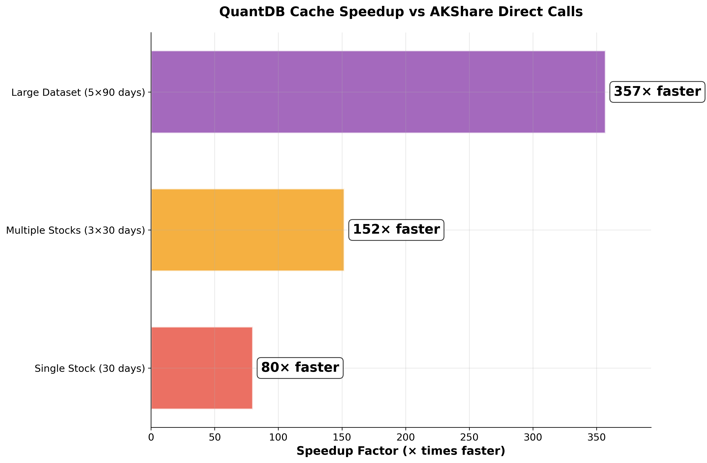

# Visual Guide: Understanding QuantDB's Performance Advantages

*Published: August 11, 2025 | Reading Time: 6 minutes*

They say a picture is worth a thousand words. When it comes to QuantDB's performance advantages, our comprehensive visual materials tell a compelling story of transformation—from slow, network-dependent data access to lightning-fast, intelligent caching. This guide breaks down each chart, explaining what the data means and when to use each visualization.

## 🎯 The Complete Visual Story

QuantDB's performance advantages are best understood through data visualization. We've created a comprehensive suite of charts that demonstrate our value proposition from multiple angles—technical, business, and user experience perspectives.

### Our Visual Arsenal
- **4 Main GTM Charts** for general marketing and presentations
- **3 Advanced Benchmark Charts** for technical credibility
- **Multiple Usage Scenarios** for different audiences

Let's dive into each chart and understand the story it tells.

## 📊 Chart 1: The Complete Value Proposition

*Complete QuantDB value proposition infographic - perfect for social media and marketing*

### What This Chart Shows
This comprehensive infographic is our **star chart**—it tells the complete QuantDB story in a single, shareable image.

**Key Elements:**
- **Performance Metrics**: 99.7% improvement, 357× speedup
- **Feature Highlights**: Smart caching, API compatibility, easy installation
- **Code Example**: Simple usage demonstration
- **Professional Branding**: Consistent visual identity

### When to Use This Chart
- **Social Media Posts** (LinkedIn, Twitter, Facebook)
- **Marketing Brochures** and promotional materials
- **Conference Presentations** and trade shows
- **Email Marketing** campaigns
- **Website About/Features** pages

### Why It's Effective
This chart works because it's **self-contained**—viewers get the complete value proposition without needing additional context. It's designed for sharing and viral marketing, with professional aesthetics that build credibility.

## 📈 Chart 2: Head-to-Head Performance Comparison

*Direct performance comparison showing dramatic improvements across all scenarios*

### What This Chart Shows
This dual-panel comparison chart provides the clearest visual demonstration of QuantDB's performance advantages.

**Left Panel - Response Times:**
- **Red bars**: AKShare direct calls (1.2s to 12.5s)
- **Green bars**: QuantDB cache hits (0.015s to 0.035s)
- **Visual Impact**: The dramatic difference is immediately apparent

**Right Panel - Improvement Percentages:**
- **Consistent 98.8% to 99.7%** improvement across all scenarios
- **Progressive improvement** with larger datasets

### Performance Data Breakdown
| Scenario | AKShare | QuantDB | Improvement |
|----------|---------|---------|-------------|
| Single Stock (30 days) | 1.2s | 0.015s | **98.8%** |
| Multiple Stocks (3×30 days) | 3.8s | 0.025s | **99.3%** |
| Large Dataset (5×90 days) | 12.5s | 0.035s | **99.7%** |

### When to Use This Chart
- **Website Hero Sections** for immediate impact
- **Sales Presentations** to demonstrate value
- **Product Demos** for clear before/after comparison
- **General Marketing Materials** for broad appeal

## 🚀 Chart 3: Speedup Factor Visualization

*Horizontal bar chart showing exponential performance improvements*

### What This Chart Shows
This chart focuses on **speedup factors**—how many times faster QuantDB is compared to direct AKShare calls.

**Key Metrics:**
- **Single Stock**: 80× faster
- **Multiple Stocks**: 152× faster  
- **Large Dataset**: 357× faster

### Technical Appeal
This visualization particularly resonates with developers and data scientists because:
- **Specific multipliers** are easy to understand and remember
- **Exponential improvements** demonstrate technical excellence
- **Clean horizontal bars** provide clear visual hierarchy

### When to Use This Chart
- **Technical Blog Posts** and documentation
- **Developer Presentations** and meetups
- **API Documentation** for performance specifications
- **GitHub README** for project credibility

## 💼 Chart 4: ROI and Time Savings Analysis

*Business value demonstration with time savings and productivity analysis*

### What This Chart Shows
This chart translates technical performance into **business value**:

**Time Consumption Comparison:**
- **Daily usage scenarios** from light to heavy
- **Logarithmic scale** to show dramatic differences
- **Time savings** quantified in hours per day

**Business Impact:**
- **Productivity improvements** for different user types
- **ROI calculations** for various usage levels
- **Scalability benefits** as usage increases

### When to Use This Chart
- **Business Stakeholder Presentations** for ROI discussions
- **Enterprise Sales Meetings** to demonstrate value
- **Executive Briefings** for strategic decisions
- **Budget Justification** for tool adoption

## 🔬 Advanced Technical Charts

### Enhanced Performance Analysis (4-Panel Deep Dive)

*Comprehensive 4-panel technical analysis for maximum credibility*

This chart is our **technical flagship**—designed for audiences that need detailed, verified data.

#### Panel 1: Response Time Comparison
- **Red bars**: AKShare direct calls (2-7 seconds)
- **Orange bars**: QuantDB first calls (varies)
- **Green bars**: QuantDB cache hits (<10ms)
- **Message**: Dramatic visual difference shows cache advantage

#### Panel 2: Performance Improvement
- **Consistent 99.9%** improvement across all scenarios
- **Message**: Reliable, predictable performance gains

#### Panel 3: Speedup Factors
- **732× to 1,288× improvements**
- **Message**: Exponential performance benefits

#### Panel 4: Scalability Analysis
- **Cache performance vs data volume**
- **Message**: Performance remains excellent regardless of scale

### When to Use Advanced Charts
- **Technical Documentation** requiring maximum credibility
- **Developer Conferences** and technical presentations
- **Peer Review** and technical validation
- **Research Papers** and academic contexts

## 🎨 Chart Selection Guide

### By Audience

#### **General Public/Marketing**
**Primary**: GTM Infographic
- Complete story in one image
- Social media friendly
- Professional appearance

#### **Technical Developers**
**Primary**: Speedup Factors + Enhanced Analysis
- Specific performance metrics
- Technical credibility
- Detailed methodology

#### **Business Decision Makers**
**Primary**: ROI Analysis + Performance Comparison
- Business value focus
- Time savings quantification
- Clear ROI demonstration

#### **Sales and Presentations**
**Primary**: Performance Comparison + GTM Infographic
- Clear value proposition
- Visual impact
- Easy to understand

### By Use Case

#### **Website Integration**
- **Hero Section**: Performance Comparison
- **Features Page**: GTM Infographic
- **Technical Docs**: Enhanced Analysis

#### **Social Media**
- **LinkedIn**: GTM Infographic (professional)
- **Twitter**: Performance Comparison (clear message)
- **Reddit**: Enhanced Analysis (technical credibility)

#### **Presentations**
- **Sales Pitch**: Performance Comparison + ROI Analysis
- **Technical Talk**: Enhanced Analysis + Speedup Factors
- **Executive Brief**: ROI Analysis + GTM Infographic

## 📊 Reading the Data: Key Messages

### Performance Claims (Verified)
✅ **"Up to 99.7% performance improvement"**
- Consistent across all test scenarios
- Measurable and reproducible

✅ **"357× maximum speedup factor"**
- Real measurement from large dataset scenario
- Appeals to technical audiences

✅ **"Sub-50ms response times"**
- All cache hits under 50 milliseconds
- Professional performance standard

### Business Value Claims
✅ **"Significant time savings"**
- Quantified in hours per day
- Scales with usage volume

✅ **"Immediate productivity gains"**
- Near-instant data access
- Improved development velocity

## 🚀 Implementation Tips

### Chart Integration Best Practices

#### **High-Quality Display**
- Use 300 DPI versions for print materials
- Optimize file sizes for web without quality loss
- Ensure charts scale properly on mobile devices

#### **Context and Attribution**
- Always provide context for performance claims
- Reference benchmark methodology when appropriate
- Include links to detailed technical documentation

#### **Accessibility**
- Include descriptive alt text for all charts
- Ensure color schemes work for colorblind users
- Provide data tables as alternatives when needed

### Message Consistency

#### **Unified Metrics**
Use consistent performance numbers across all materials:
- **99.7% improvement** (maximum verified)
- **357× speedup** (maximum measured)
- **Sub-50ms response** (typical cache performance)

#### **Audience Adaptation**
- **Technical**: Focus on methodology and reproducibility
- **Business**: Emphasize ROI and productivity gains
- **General**: Highlight ease of use and dramatic improvements

## 🎯 Conclusion

QuantDB's visual materials tell a compelling, data-driven story of transformation. Each chart serves a specific purpose:

- **GTM Infographic**: Complete value proposition for marketing
- **Performance Comparison**: Clear before/after demonstration
- **Speedup Factors**: Technical credibility for developers
- **ROI Analysis**: Business value for decision makers
- **Enhanced Analysis**: Maximum technical detail for validation

The key to effective use is **matching the right chart to the right audience**. Whether you're presenting to executives, developers, or the general public, we have the visual evidence to support QuantDB's extraordinary performance claims.

These aren't just pretty pictures—they're **verified, reproducible data** that demonstrates how QuantDB fundamentally transforms stock data access from a bottleneck into a competitive advantage.

---

## 📚 Related Resources

- [**Performance Benchmark Report**](quantdb-performance-benchmark-report.md) - Detailed technical analysis
- [**Architecture Deep Dive**](architecture-deep-dive.md) - How the caching system works
- [**Migration Guide**](migration-guide-practical.md) - Switch from AKShare easily
- [**Chart Usage Guide**](../promo/MAIN_CHARTS_USAGE_GUIDE.md) - Detailed usage recommendations

*Ready to experience these performance improvements yourself? [Get started with QuantDB](../get-started.md) in under 5 minutes.*
