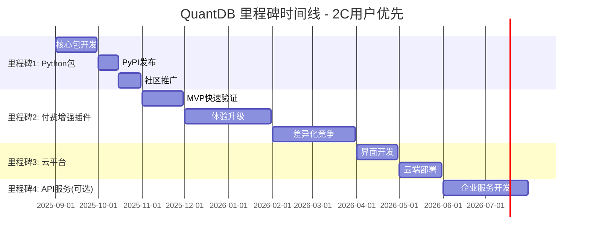

# QuantDB 项目里程碑规划

**版本**: v2.2.7 | **更新**: 2025-08-11

## 🎯 项目愿景

QuantDB 致力于为**个人开发者和研究人员**提供高性能的股票数据工具，通过简单易用的Python包和付费增强功能，快速实现商业化变现。

## 📈 里程碑概览



## 🚀 里程碑1: Python包产品

### 🎯 核心价值定位
**智能缓存的AKShare包装器** - 为个人开发者提供本地高性能股票数据库

### ✨ 核心亮点
- **一行代码使用**: `pip install quantdb` 即可享受缓存加速
- **本地SQLite缓存**: 自动管理本地数据库，离线可用
- **智能增量更新**: 只获取缺失数据，避免重复请求
- **完全兼容AKShare**: 保持相同的API接口，无缝替换
- **零配置启动**: 自动初始化，开箱即用

### 🚀 用户使用体验
```python
# 安装
pip install quantdb

# 使用 - 与AKShare完全兼容的API
import quantdb as qdb

# 获取股票数据（享受缓存加速）
df = qdb.stock_zh_a_hist("000001", start_date="20240101", end_date="20240201")

# 简化API（推荐使用）
df = qdb.get_stock_data("000001", days=30)
stocks_data = qdb.get_multiple_stocks(["000001", "000002"], days=30)

# 缓存管理
stats = qdb.cache_stats()  # 查看缓存统计
qdb.clear_cache()         # 清除缓存
```

### 🎯 目标用户
- **量化研究者**: 需要频繁获取股票数据进行回测
- **Python开发者**: 构建股票相关应用和工具
- **数据科学家**: 进行金融数据分析和建模
- **个人投资者**: 编写投资策略和分析脚本

### 📈 商业价值
- **性能提升**: 比直接使用AKShare快90%+
- **开发效率**: 减少等待时间，提高开发体验
- **用户基础**: 为后续付费功能建立用户群体

## 💰 里程碑2: 付费增强插件包

### 🎯 核心价值定位
**针对个人用户的付费增强功能** - 通过高价值功能实现快速商业化变现

### ✨ 三阶段商业化路线图

#### 🚀 阶段1（第1个月）— MVP快速验证
**目标**: 测试付费意愿，快速回收开发成本

**核心功能**:
- **高级数据源**: 港股、美股日线数据（付费专享）
- **历史数据扩展**: 1990年至今完整数据
- **自动更新**: 每日收盘后自动获取最新数据
- **License Key校验**: 简单本地验证机制

💡 **成功标志**: 首月获得10+付费用户

#### 📈 阶段2（第3个月）— 体验升级
**目标**: 提升用户体验，增强付费理由

**新增功能**:
- **可视化增强**: 内置技术指标（MACD、RSI、布林带）
- **交互式图表**: 一行代码生成K线+成交量图
- **多线程加速**: 数据拉取速度提升5-10倍
- **云同步**: 多设备数据同步（GitHub Gist）
- **分级定价**: 基础版($9.99) + 高级版($19.99)

💡 **成功标志**: 用户留存率>50%，有升级转化

#### 🏆 阶段3（第6个月）— 差异化竞争
**目标**: 打造独特功能，形成竞争壁垒

**新增功能**:
- **策略回测**: 经典策略模板，直接回测
- **高级存储**: MySQL/PostgreSQL/DuckDB集成
- **云服务版**: 网页UI + API Token，免费额度+订阅

💡 **成功标志**: 社区自发推广，月收入>$2000

### 📊 功能对比表

| 功能特性 | 免费版 | 基础增强包 | 高级增强包 |
|---------|-------|-----------|-----------|
| **A股历史数据** | ✅ 近3年 | ✅ 1990年至今 | ✅ 1990年至今 |
| **港股/美股数据** | ❌ | ✅ | ✅ |
| **自动更新** | ❌ | ✅ | ✅ |
| **技术指标+图表** | ❌ | ❌ | ✅ |
| **多线程加速** | ❌ | ✅ | ✅ |
| **云同步** | ❌ | ❌ | ✅ |
| **策略回测** | ❌ | ❌ | ✅ |
| **价格** | 免费 | $9.99/月 | $19.99/月 |

## ☁️ 里程碑3: 云平台产品

### 🎯 核心价值定位
**无代码股票数据平台** - 为非编程用户提供可视化数据分析工具

### ✨ 核心亮点
- **Web界面**: 基于Streamlit的用户友好界面
- **数据可视化**: 股票图表、技术指标、趋势分析
- **云端部署**: Streamlit Cloud一键访问
- **无需编程**: 点击操作，降低使用门槛

### 🎯 目标用户
- **个人投资者**: 需要股票数据查询和分析工具
- **金融从业者**: 需要快速数据查看平台
- **教育用户**: 金融数据学习和研究

### 📈 商业价值
- **用户扩展**: 覆盖非编程用户群体
- **付费转化**: 引导用户使用Python包和付费功能

## 🏢 里程碑4: API服务（可选）

### 🎯 核心价值定位
**企业级股票数据API服务** - 为企业和团队提供高性能数据接口

### ✨ 核心亮点
- **高性能**: 响应时间<20ms（缓存命中）
- **企业级**: 完整的认证、监控、限流机制
- **统一接口**: A股+港股+美股数据统一API

### 🎯 目标用户
- **金融科技公司**: 需要集成股票数据服务
- **量化交易团队**: 需要高性能API接口
- **企业内部**: 数据分析和决策支持系统

### 📈 商业价值
- **B2B收入**: 按调用量或订阅收费
- **技术展示**: 展示QuantDB的技术实力


## 📅 发布时间线

### 2025年9-10月 - 里程碑1: Python包
- [ ] 核心包开发和缓存系统实现
- [ ] PyPI发布和社区推广
- [ ] 用户反馈收集和功能完善

### 2025年11月-2026年3月 - 里程碑2: 付费增强插件包
- [ ] **阶段1（11月）**: MVP快速验证
  - [ ] 港股/美股数据扩展
  - [ ] 自动更新功能
  - [ ] License Key校验和购买入口
- [ ] **阶段2（12月-1月）**: 体验升级
  - [ ] 可视化增强和技术指标
  - [ ] 多线程加速和云同步
  - [ ] 分级定价策略
- [ ] **阶段3（2月-3月）**: 差异化竞争
  - [ ] 策略回测模块
  - [ ] 高级存储支持
  - [ ] 个人云服务版

### 2026年4-5月 - 里程碑3: 云平台
- [ ] Streamlit界面开发
- [ ] 云端部署和用户体验优化

### 2026年6-7月 - 里程碑4: API服务（可选）
- [ ] 企业级API服务开发
- [ ] 认证和监控系统

## 🎯 成功指标

### 里程碑1: Python包
- **PyPI下载量** > 1000次/月
- **GitHub Stars** > 50
- **缓存命中率** > 90%

### 里程碑2: 付费增强插件包
- **阶段1**: 首月付费用户 > 10人，收入覆盖开发成本
- **阶段2**: 用户留存率 > 50%，月收入 > $500
- **阶段3**: 自然推广占比 > 30%，月收入 > $2000

### 里程碑3: 云平台
- **月活跃用户** > 100
- **用户满意度** > 4.5/5

### 里程碑4: API服务
- **企业客户** > 5家
- **API调用量** > 10000次/天

## 🔄 核心策略

### 敏捷开发原则
- **MVP优先**: 每个里程碑都是最小可行产品
- **快速迭代**: 2周一个Sprint，持续改进
- **用户驱动**: 基于用户反馈调整功能优先级

### 商业化策略
- **免费+付费模式**: 免费版吸引用户，付费版提供高价值功能
- **快速验证**: 1个月MVP验证，边做边测试市场反应
- **分级定价**: 基础版($9.99) + 高级版($19.99)满足不同需求
- **多渠道变现**: Gumroad、爱发电、GitHub Sponsors等多平台支持

## 📋 立即行动建议

### 🚀 第一步：在README添加付费预告
> "现在支持美股/港股历史全数据 & 自动更新功能，解锁请点击这里（$9.99首发优惠）"

### 💡 关键成功因素
1. **快速验证**: 不等所有功能完成就开始收费测试
2. **用户反馈**: 持续收集付费用户的使用反馈
3. **社区建设**: 通过优质内容和用户服务建立口碑

---

*最后更新: 2025-08-11 | 下次评估: 每月第一周*
