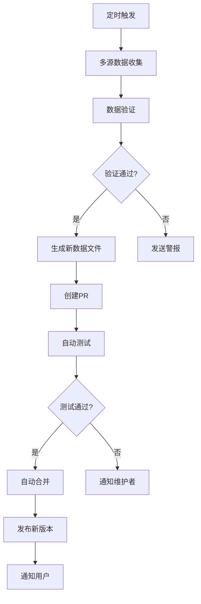

# 港股交易日历补丁项目 (HK Trading Calendar Patch Project)

## 📋 项目概述

### 🎯 项目背景
在开发 QuantDB 过程中，我们发现了一个影响全球金融开发者的重要问题：现有的金融数据库（如 pandas_market_calendars）在处理港股交易日历时存在严重缺陷，特别是在中国春节假期的处理上。

### 🔍 问题发现过程
1. **初始发现**: 在 QuantDB 数据收集过程中，发现某些日期无法获取港股数据
2. **问题定位**: 通过验证发现 pandas_market_calendars 的 XHKG 日历错误地将春节假期标记为交易日
3. **影响评估**: 这个问题影响全球使用港股数据的金融应用、回测系统和学术研究

### 🎯 项目目标
创建一个独立的、权威的港股交易日历数据包，解决现有开源库的数据准确性问题，并为全球开发者提供可靠的港股交易日历数据。

## 🔬 问题验证和分析

### 📊 Bug 验证结果
通过我们的验证脚本 `verify_xhkg_bug.py`，确认了以下问题：

#### 2024年春节假期错误
- **2024-02-09 (Friday)**: ❌ 错误标记为交易日
- **2024-02-14 (Wednesday)**: ❌ 错误标记为交易日  
- **2024-02-15 (Thursday)**: ❌ 错误标记为交易日
- **2024-02-16 (Friday)**: ❌ 错误标记为交易日

#### 历史年份问题
- **2023年**: 2023-01-26, 2023-01-27 错误标记为交易日
- **2025年**: 2025-01-28, 2025-02-03 预期错误标记为交易日

#### 数据源对比
与上海证券交易所 (XSHG) 对比显示，大陆股市正确处理了春节假期，而港股日历存在不一致性。

### 📚 官方文档支持
1. **港股通交易日安排公告**: 明确说明春节期间不提供港股通服务
2. **上海证券交易所公告**: 确认春节期间休市安排
3. **香港交易所官方**: 遵循中国大陆春节假期安排

### 🎯 根本原因分析
- HKEX 日历实现只包含香港本地节假日
- 缺少中国春节假期的处理逻辑
- 港股的特殊性：需要同时考虑香港和中国大陆节假日

## 💡 解决方案设计

### 🏗️ 项目架构

#### 核心理念
- **独立性**: 不依赖任何特定框架，通用性强
- **权威性**: 基于多源验证，数据准确可靠
- **易用性**: 简单的API，易于集成
- **开放性**: 开源项目，全球受益
- **可维护性**: 清晰的架构，易于更新维护

#### 技术架构
```
hk-trading-calendar/
├── 数据层 (Data Layer)
│   ├── 原始数据收集
│   ├── 多源数据验证
│   └── 标准化数据输出
├── 核心功能层 (Core Layer)
│   ├── 交易日判断
│   ├── 日期范围查询
│   └── 节假日信息查询
├── 集成层 (Integration Layer)
│   ├── pandas_market_calendars 补丁
│   ├── QuantLib 集成
│   └── 其他金融库支持
└── 服务层 (Service Layer)
    ├── RESTful API
    ├── 数据文件发布
    └── 自动化更新
```

### 📦 项目结构
```
hk-trading-calendar/
├── README.md                 # 项目介绍和使用说明
├── LICENSE                   # MIT 许可证
├── setup.py                  # Python 包配置
├── pyproject.toml           # 现代 Python 包配置
├── requirements.txt         # 依赖列表
├── .gitignore              # Git 忽略文件
├── .github/                # GitHub 配置
│   ├── workflows/          # CI/CD 配置
│   │   ├── test.yml       # 自动测试
│   │   ├── publish.yml    # 自动发布
│   │   └── data-update.yml # 数据更新
│   └── ISSUE_TEMPLATE/    # Issue 模板
├── hk_trading_calendar/    # 主要代码
│   ├── __init__.py
│   ├── core.py            # 核心功能
│   ├── data_sources.py    # 数据源集成
│   ├── validators.py      # 数据验证
│   └── integrations/      # 第三方库集成
│       ├── __init__.py
│       ├── pandas_market_calendars.py
│       └── quantlib.py
├── data/                   # 数据文件
│   ├── hk_trading_days.json
│   ├── hk_holidays.json
│   └── metadata.json
├── tests/                  # 测试代码
│   ├── test_core.py
│   ├── test_integrations.py
│   └── test_data_quality.py
├── docs/                   # 文档
│   ├── index.md
│   ├── api.md
│   └── integrations.md
└── scripts/               # 工具脚本
    ├── collect_data.py    # 数据收集
    ├── validate_data.py   # 数据验证
    └── update_data.py     # 数据更新
```

## 🤖 自动化更新系统

### 🔄 更新流程设计


### 📊 数据源策略
1. **香港交易所官方**: 最权威的数据源
2. **AKShare**: 历史数据验证
3. **Wind数据库**: 商业数据源验证
4. **人工整理**: 关键节假日的权威确认
5. **备用数据源**: GitHub、其他开源项目

### 🛡️ 数据质量保证
#### 多层次验证
1. **基础验证**: 格式、顺序、周末排除
2. **业务验证**: 春节假期、节假日完整性
3. **一致性验证**: 多数据源交叉验证
4. **深度验证**: 统计分析、外部验证

#### 质量指标
- 数据源一致性 > 95%
- 春节假期准确率 = 100%
- 历史数据连续性检查
- 年度交易日数量合理性 (240-260天)

### ⚡ 自动化特性
- **每日检查**: UTC 02:00 (香港时间 10:00)
- **智能更新**: 只在有变化时更新
- **版本管理**: 自动版本号递增
- **回滚机制**: 验证失败时自动回滚
- **通知系统**: 成功/失败状态通知

## 🌍 发布和分发策略

### 📦 多渠道发布
1. **PyPI**: `pip install hk-trading-calendar`
2. **GitHub Releases**: 数据文件和源码发布
3. **RESTful API**: 在线查询服务
4. **文档站点**: 完整的使用文档

### 🔧 集成支持
#### pandas_market_calendars 集成
```python
import hk_trading_calendar
hk_trading_calendar.patch_pandas_market_calendars()

# 现在 XHKG 日历数据准确
import pandas_market_calendars as mcal
hk_cal = mcal.get_calendar('XHKG')
```

#### QuantDB 集成
```python
from hk_trading_calendar import HKTradingCalendar

class TradingCalendar:
    def __init__(self):
        self.hk_patch = HKTradingCalendar()
    
    def is_trading_day(self, date: str, symbol: str = None) -> bool:
        market = Market.from_symbol(symbol)
        if market == Market.HONG_KONG:
            return self.hk_patch.is_trading_day(date)
        # ... 其他市场逻辑
```

### 📈 推广策略
1. **技术社区**: GitHub、Stack Overflow、Reddit
2. **学术合作**: 与金融学术机构合作
3. **开源贡献**: 向主要金融库提交PR
4. **文档和教程**: 详细的使用指南和案例

## 📊 项目价值和影响

### 🎯 技术价值
- **数据准确性**: 解决全球港股数据不准确问题
- **标准化**: 建立港股交易日历的权威标准
- **开源贡献**: 推动金融开源工具发展
- **学术支持**: 为研究提供可靠数据基础

### 🌍 社会影响
- **全球受益**: 所有使用港股数据的开发者
- **教育价值**: 为学生和研究者提供准确数据
- **行业标准**: 可能成为行业参考标准
- **开源精神**: 体现开源社区的协作价值

### 💼 商业价值
- **技术声誉**: 在金融科技领域建立影响力
- **合作机会**: 可能带来商业合作机会
- **人才吸引**: 展示技术实力，吸引优秀人才
- **品牌建设**: 为 QuantDB 项目增加知名度

## 🗓️ 项目路线图

### Phase 1: MVP开发 (2-3周)
**目标**: 创建基本可用的港股交易日历补丁

**任务清单**:
- [ ] 创建 GitHub 仓库
- [ ] 实现核心功能类 `HKTradingCalendar`
- [ ] 收集和验证基础数据 (2020-2025)
- [ ] 实现 pandas_market_calendars 集成
- [ ] 编写基础测试用例
- [ ] 创建项目文档和 README

**交付物**:
- 可用的 Python 包
- 基础数据文件
- pandas_market_calendars 补丁
- 项目文档

### Phase 2: 完善和验证 (3-4周)
**目标**: 完善功能，提高数据质量和可靠性

**任务清单**:
- [ ] 实现多数据源收集
- [ ] 建立数据验证系统
- [ ] 添加更多第三方库集成
- [ ] 完善测试覆盖率 (>90%)
- [ ] 建立 CI/CD 流程
- [ ] 创建详细的API文档

**交付物**:
- 多源验证的数据
- 完整的测试套件
- CI/CD 自动化
- API 文档

### Phase 3: 自动化和发布 (2-3周)
**目标**: 建立自动化更新系统，正式发布

**任务清单**:
- [ ] 实现自动化数据更新系统
- [ ] 建立数据质量监控
- [ ] PyPI 包发布
- [ ] 创建项目网站
- [ ] 社区推广和宣传

**交付物**:
- 自动化更新系统
- PyPI 发布的包
- 项目官网
- 社区推广材料

### Phase 4: 维护和扩展 (持续)
**目标**: 长期维护，功能扩展，社区建设

**任务清单**:
- [ ] 定期数据更新和验证
- [ ] 用户反馈收集和处理
- [ ] 功能扩展和优化
- [ ] 社区建设和合作
- [ ] 与主要金融库的官方合作

**交付物**:
- 稳定的数据服务
- 活跃的开源社区
- 行业合作关系

## 🔧 技术实现细节

### 核心API设计
```python
class HKTradingCalendar:
    def is_trading_day(self, date: str) -> bool
    def get_trading_days(self, start: str, end: str) -> List[str]
    def get_holiday_info(self, date: str) -> Optional[Dict]
    def get_next_trading_day(self, date: str) -> str
    def get_previous_trading_day(self, date: str) -> str
    def count_trading_days(self, start: str, end: str) -> int
```

### 数据格式标准
```json
{
  "metadata": {
    "version": "1.0.0",
    "last_update": "2025-08-14T15:24:01Z",
    "data_sources": ["HKEX", "AKShare", "Wind"],
    "validation_status": "passed",
    "coverage_years": [2000, 2030]
  },
  "trading_days": ["20000103", "20000104", "..."],
  "holidays": {
    "20240215": {
      "name": "春节假期",
      "name_en": "Chinese New Year Holiday",
      "type": "chinese_new_year",
      "confirmed_by": ["HKEX", "SSE"]
    }
  }
}
```

## 📋 风险评估和应对

### 🚨 主要风险
1. **数据源可靠性**: 依赖的数据源可能变更或不可用
2. **维护负担**: 长期维护需要持续投入
3. **法律风险**: 数据使用的法律合规性
4. **竞争风险**: 其他项目可能解决同样问题

### 🛡️ 风险应对
1. **多源备份**: 建立多个数据源，降低单点故障风险
2. **社区化**: 建立开源社区，分担维护负担
3. **合规审查**: 确保数据使用符合相关法律法规
4. **差异化**: 专注于数据质量和易用性，建立竞争优势

## 📞 项目联系和协作

### 👥 项目团队
- **项目发起人**: Frank (QuantDB 创始人)
- **技术负责人**: 待定
- **数据验证**: 待定
- **社区管理**: 待定

### 🤝 合作机会
- **学术合作**: 与金融学院、商学院合作
- **行业合作**: 与金融数据提供商合作
- **开源合作**: 与其他金融开源项目合作
- **商业合作**: 与金融科技公司合作

### 📧 联系方式
- **GitHub**: 项目仓库 Issues
- **邮件**: 项目维护者邮箱
- **社区**: Discord/Slack 频道

---

## 📝 附录

### 🔗 相关链接
- [pandas_market_calendars GitHub](https://github.com/rsheftel/pandas_market_calendars)
- [香港交易所官网](https://www.hkex.com.hk/)
- [上海证券交易所](http://www.sse.com.cn/)

### 📚 参考文档
- 港股通交易日安排公告
- 香港交易所交易规则
- pandas_market_calendars 文档

### 🏷️ 项目标签
`hong-kong` `trading-calendar` `finance` `stock-market` `hkex` `pandas` `quantitative-finance` `open-source` `data-quality`

## 🛠️ 技术实施指南

### 📋 开发环境要求
```bash
# Python 环境
Python >= 3.8
pandas >= 1.3.0
requests >= 2.25.0
pytest >= 6.0.0

# 可选依赖
akshare >= 1.8.0  # 数据源
chinese-calendar >= 1.7.0  # 中国节假日
```

### 🔧 核心代码框架

#### 主要类设计
```python
class HKTradingCalendar:
    """港股交易日历核心类"""

    def __init__(self, data_file: Optional[str] = None):
        self.data_file = data_file or self._get_default_data_file()
        self._trading_days: Set[str] = set()
        self._holidays: Dict[str, str] = {}
        self._metadata: Dict = {}
        self._load_data()

    def is_trading_day(self, date: str) -> bool:
        """判断是否为交易日"""

    def get_trading_days(self, start: str, end: str) -> List[str]:
        """获取日期范围内的交易日"""

    def get_holiday_info(self, date: str) -> Optional[Dict]:
        """获取节假日信息"""

class DataCollector:
    """多源数据收集器"""

    def collect_from_hkex(self) -> Dict:
        """从香港交易所官方收集"""

    def collect_from_akshare(self) -> Dict:
        """从AKShare收集历史数据"""

    def collect_from_manual(self) -> Dict:
        """从人工整理数据收集"""

class DataValidator:
    """数据验证器"""

    def validate_all(self, data_sources: Dict) -> Dict:
        """执行全面数据验证"""

    def _check_chinese_new_year(self, data: Dict) -> Dict:
        """验证春节假期处理"""
```

### 📊 数据收集策略详解

#### 1. 香港交易所官方数据
```python
def collect_hkex_official():
    """
    数据源: https://www.hkex.com.hk/Services/Trading/Securities/Overview/Trading-Calendar
    方法: 网页爬虫 + PDF解析
    频率: 每日检查
    可靠性: 最高
    """
    # 实现网页解析逻辑
    # 处理PDF格式的交易日历
    # 提取节假日安排
```

#### 2. AKShare历史数据推断
```python
def collect_akshare_data():
    """
    数据源: AKShare港股历史数据
    方法: 通过有交易数据的日期推断交易日
    符号: 00700 (腾讯控股) - 流动性好的港股
    时间范围: 2000-2030
    可靠性: 中等
    """
    # 获取历史股价数据
    # 提取有交易的日期
    # 推断节假日
```

#### 3. 人工权威数据
```python
def collect_manual_data():
    """
    数据源: 官方公告、新闻、权威网站
    方法: 人工整理和验证
    重点: 春节假期、特殊安排
    可靠性: 最高
    """
    # 关键春节假期数据
    # 特殊交易安排
    # 历史验证数据
```

### 🔍 验证算法设计

#### 多源交叉验证
```python
def cross_validate_sources(sources: Dict[str, Set[str]]) -> Dict:
    """
    算法: 多数投票 + 权重评分
    权重: 官方数据 > 人工数据 > 历史数据 > 推断数据
    阈值: 一致性 >= 95% 才通过验证
    """
    # 计算各数据源的交集和差集
    # 应用权重评分
    # 生成最终的权威数据
```

#### 春节假期特殊验证
```python
def validate_chinese_new_year(data: Dict) -> bool:
    """
    验证规则:
    1. 春节假期必须连续
    2. 与大陆股市保持一致
    3. 符合农历新年规律
    4. 官方公告确认
    """
    # 检查春节假期连续性
    # 对比大陆股市数据
    # 验证农历计算
```

### 🚀 部署和发布流程

#### GitHub Actions工作流
```yaml
# 自动化流程:
# 1. 数据收集 (每日02:00 UTC)
# 2. 数据验证 (多层次检查)
# 3. 创建PR (如有变更)
# 4. 自动测试 (CI/CD)
# 5. 自动合并 (测试通过)
# 6. 版本发布 (自动标签)
# 7. PyPI发布 (自动推送)
```

#### 版本管理策略
```
版本格式: MAJOR.MINOR.PATCH
- MAJOR: 重大架构变更
- MINOR: 新功能添加
- PATCH: 数据更新、Bug修复

示例:
v1.0.0 - 初始发布
v1.0.1 - 数据更新
v1.1.0 - 新增API功能
v2.0.0 - 架构重构
```

### 📈 性能和扩展性

#### 性能优化
```python
# 数据加载优化
- 延迟加载: 只在需要时加载数据
- 缓存机制: 内存缓存常用查询
- 索引优化: 日期索引加速查询

# 查询优化
- 二分查找: 快速日期查找
- 范围查询: 优化批量查询
- 并发安全: 线程安全的数据访问
```

#### 扩展性设计
```python
# 插件架构
class DataSourcePlugin:
    """数据源插件接口"""
    def collect_data(self) -> Dict
    def validate_data(self, data: Dict) -> bool

# 集成插件
class IntegrationPlugin:
    """第三方库集成插件接口"""
    def patch_library(self) -> bool
    def test_integration(self) -> bool
```

## 📊 项目指标和监控

### 🎯 关键指标 (KPIs)
```
数据质量指标:
- 春节假期准确率: 100%
- 多源一致性: >= 95%
- 数据覆盖率: 2000-2030年
- 更新及时性: <= 24小时

项目影响指标:
- GitHub Stars: 目标 1000+
- PyPI下载量: 目标 10000+/月
- 集成项目数: 目标 50+
- 社区贡献者: 目标 20+

技术指标:
- 测试覆盖率: >= 90%
- API响应时间: <= 100ms
- 数据文件大小: <= 1MB
- 内存使用: <= 10MB
```

### 📈 监控和告警
```python
# 数据质量监控
def monitor_data_quality():
    """
    监控项目:
    - 数据源可用性
    - 验证通过率
    - 异常数据检测
    - 用户反馈分析
    """

# 性能监控
def monitor_performance():
    """
    监控项目:
    - API响应时间
    - 内存使用情况
    - 下载统计
    - 错误率统计
    """
```

## 🤝 社区建设和维护

### 👥 社区角色定义
```
核心维护者 (Core Maintainers):
- 代码审查和合并
- 架构决策
- 发布管理

数据验证员 (Data Validators):
- 数据质量检查
- 新数据源验证
- 异常数据调查

文档维护者 (Documentation Maintainers):
- 文档更新
- 教程编写
- FAQ维护

社区管理员 (Community Managers):
- Issue管理
- 用户支持
- 社区活动组织
```

### 📋 贡献指南
```markdown
# 贡献类型
1. 数据贡献: 提供新的数据源或验证现有数据
2. 代码贡献: 功能开发、Bug修复、性能优化
3. 文档贡献: 文档改进、教程编写、翻译
4. 测试贡献: 测试用例编写、质量保证
5. 反馈贡献: Bug报告、功能建议、使用反馈

# 贡献流程
1. Fork项目仓库
2. 创建功能分支
3. 开发和测试
4. 提交Pull Request
5. 代码审查
6. 合并到主分支
```

### 🎯 社区发展策略
```
短期目标 (3个月):
- 建立核心团队 (5-10人)
- 完成MVP开发
- 获得初始用户反馈

中期目标 (6个月):
- 扩大用户基础 (1000+ stars)
- 建立稳定的数据更新流程
- 与主要金融库建立合作

长期目标 (1年):
- 成为港股日历的标准数据源
- 建立活跃的开源社区
- 扩展到其他亚洲市场
```

## 💰 商业化和可持续性

### 🎯 可持续发展模式
```
开源核心 + 增值服务:
- 核心功能: 完全开源免费
- 高级API: 商业用户付费服务
- 定制服务: 企业级定制开发
- 培训服务: 专业培训和咨询

赞助和捐赠:
- GitHub Sponsors
- 企业赞助
- 基金会支持
- 个人捐赠
```

### 📊 成本效益分析
```
开发成本:
- 初期开发: 2-3个月全职开发
- 持续维护: 每月20-40小时
- 基础设施: GitHub免费 + 少量云服务

预期收益:
- 技术声誉提升
- 商业合作机会
- 人才吸引
- 品牌价值增长

投资回报:
- 短期: 技术影响力
- 中期: 商业机会
- 长期: 行业标准地位
```

---

## 📝 决策记录

### 🎯 关键技术决策
1. **编程语言**: Python - 金融领域主流，生态丰富
2. **数据格式**: JSON - 轻量级，易于解析和扩展
3. **许可证**: MIT - 最大化开源友好性和商业兼容性
4. **版本控制**: 语义化版本 - 清晰的版本管理
5. **测试框架**: pytest - Python标准测试框架

### 📋 架构决策
1. **独立项目**: 不依赖QuantDB，最大化复用性
2. **插件架构**: 支持多种数据源和集成方式
3. **数据驱动**: 基于数据文件，而非硬编码逻辑
4. **向后兼容**: 保证API稳定性
5. **云原生**: 支持容器化部署和云服务

### 🔄 流程决策
1. **自动化优先**: 最大化自动化，减少人工干预
2. **质量第一**: 数据质量优于发布速度
3. **社区驱动**: 开放决策过程，接受社区反馈
4. **渐进式发布**: 小步快跑，持续改进
5. **文档先行**: 完善文档，降低使用门槛

---

**文档版本**: v1.0
**创建日期**: 2025-08-14
**最后更新**: 2025-08-14
**状态**: 规划阶段
**下次审查**: 待项目启动时
